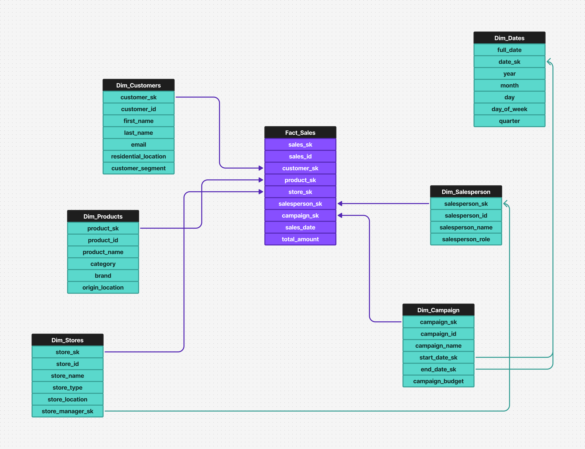

## Databricks Metric Views - Retail Store Dimensional Model (demo)

This is a simple demo of how you can use Metric Views in Databricks to create your semantic models directly in our platform.  
This demo is using the [Retail Store Star Schema Dataset](https://www.kaggle.com/datasets/shrinivasv/retail-store-star-schema-dataset?select=fact_sales_denormalized.csv). 

Adding your semantic models directly in Databricks lets you benefit from using the Databricks compute for querying your data, despites also being integrated to the Unity Catalog, allowing for truly unified governance and optimal performance.

For more info on Metric Views, make sure to also check our public-facing materials:
- [Docs - Unity Catalog metric views](https://docs.databricks.com/aws/en/metric-views/)
- [Video - Unity Catalog Metric Views Overview](https://www.databricks.com/resources/demos/videos/unity-catalog-metric-views-overview)
- [Video - Understanding Your Business With Unity Catalog Metric Views](https://www.databricks.com/resources/demos/videos/understanding-your-business-with-unity-catalog-metric-view)